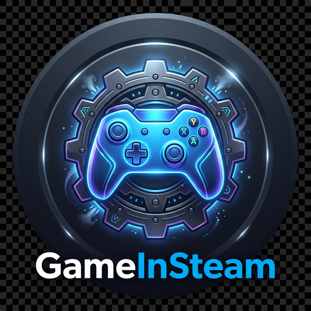

# 🎮 GameInSteam (v5.0)

**Ultimate Steam Library Manager** — Add any game to your Steam library with professional ease.

---

## ✨ Features (TR / EN)

### 🇹🇷 Özellikler
- **Tek Tıkla Oyun Ekleme** — Steam App ID girin ve oyun kütüphanenize eklensin.
- **Profesyonel Kurulum** — "Next-Next-Finish" basitliğinde yeni Nesil Kurucu.
- **Otomatik Dosya Yönetimi** — Gerekli tüm dosyalar (DLL'ler dahil) otomatik yerleştirilir.
- **Modern Arayüz** — Tamamen yenilenmiş, şık ve hızlı karanlık mod arayüzü.
- **Toplu Ekleme** — Virgülle ayırarak birden fazla oyunu aynı anda ekleyin.

### 🇬🇧 Features
- **One-Click Execution** — Enter a Steam App ID and the game is ready in your library.
- **Professional Installer** — Brand new "Next-Next-Finish" setup experience.
- **Automatic File Handling** — All necessary files (including DLLs) are placed automatically.
- **Premium Dark UI** — Completely redesigned, sleek, and fast dark mode interface.
- **Batch Adding** — Add multiple games at once using comma-separated IDs.

---

## 📥 Kurulum / Installation

### 🇹🇷 Kolay Kurulum (Önerilen)
1. **`GameInSteam_Setup_v5.0.exe`** dosyasını indirin.
2. Çalıştırın ve **İleri -> Kur -> Bitir** adımlarını izleyin.
3. Masaüstündeki kısayola tıklayıp kullanmaya başlayın!

### 🇬🇧 Easy Setup (Recommended)
1. Download **`GameInSteam_Setup_v5.0.exe`**.
2. Run it and follow **Next -> Install -> Finish**.
3. Launch from the Desktop shortcut and you're good to go!

---

## 🚀 Kullanım / How to Use

1. **GameInSteam**'i açın.
2. **"Add Game"** sekmesine gidin.
3. Oyunun **App ID**'sini girin (örn: CS2 için `730`).
4. **"Add Game"** butonuna basın.
5. İşlem bitince Steam'i yeniden başlatın ve oyunun tadını çıkarın!

---

## ⚙️ Gereksinimler / Requirements

| Requirement | Details |
|---|---|
| **OS** | Windows 10 / 11 (64-bit) |
| **Steam** | Installed |

---

## ⚠️ Disclaimer
This software is provided for educational purposes only. Use at your own risk. GameInSteam is not affiliated with Valve Corporation or Steam.

---

## 📄 License
Released under the [MIT License](LICENSE).
